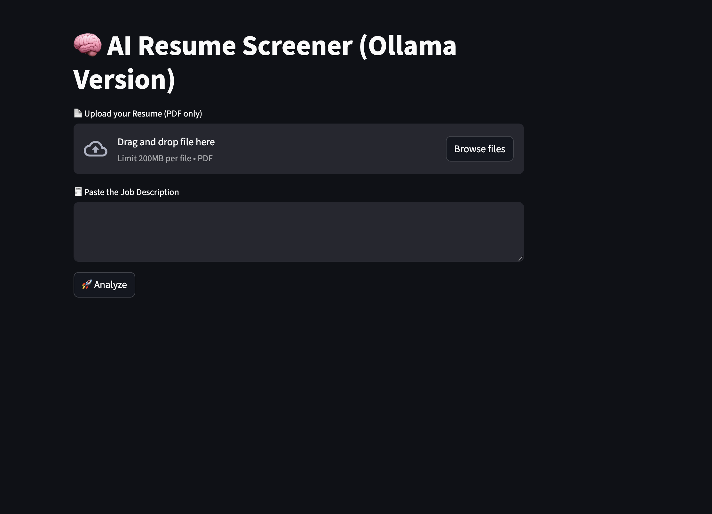
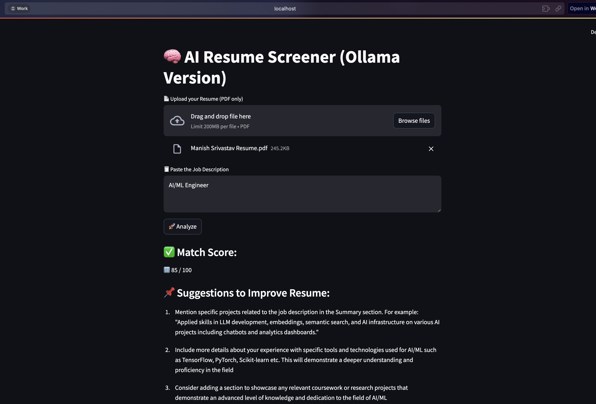

# 🧠 AI Resume Screener (Ollama-Powered)

This project is an AI-powered resume analyzer that compares a resume with a job description and provides:
- A match score (out of 100)
- 3 actionable suggestions to improve the resume

It runs **completely offline** using **Mistral LLM** on **Ollama**, and has a clean frontend built using **Streamlit**.

---

## 🚀 Features

✅ Upload resume (PDF)  
✅ Paste job description  
✅ Instant AI response  
✅ No API key needed — works 100% locally  
✅ Clear, professional output with suggestions  

---

## 🧰 Tech Stack

| Component | Tool |
|----------|------|
| 💻 UI | Streamlit |
| 🧠 LLM | Mistral via Ollama |
| 📄 Resume Parsing | PyMuPDF |
| 🔗 Backend Calls | Python `requests` |

---

## ⚙️ Setup & Run

### 1. Clone the repo

```bash
git clone https://github.com/<your-username>/resume-screener-ai.git
cd resume-screener-ai
```

### 2. Install Python dependencies
```bash
pip install -r requirements.txt
```

### 3. Start Ollama with Mistral
```bash
ollama run mistral
```

### 4. Run the Streamlit App
```bash
streamlit run app.py
```

---

### 🧠 Prompt Format Used
```text
Score: <score out of 100>

Suggestions:
1. <suggestion 1>
2. <suggestion 2>
3. <suggestion 3>
```
This prompt is passed to Mistral through Ollama to ensure clean and structured output.

---

### 🗂️ Folder Structure
```Folder Structure
resume-screener-ai/
│
├── app.py                 # Streamlit UI
├── utils.py               # API call + logic
├── resume_parser.py       # PDF parsing
├── requirements.txt       # Python dependencies
├── README.md              # Project info
└── sample_files/          # Optional test resumes/JDs
```
---

 ## 🖼️ Demo Screenshots



